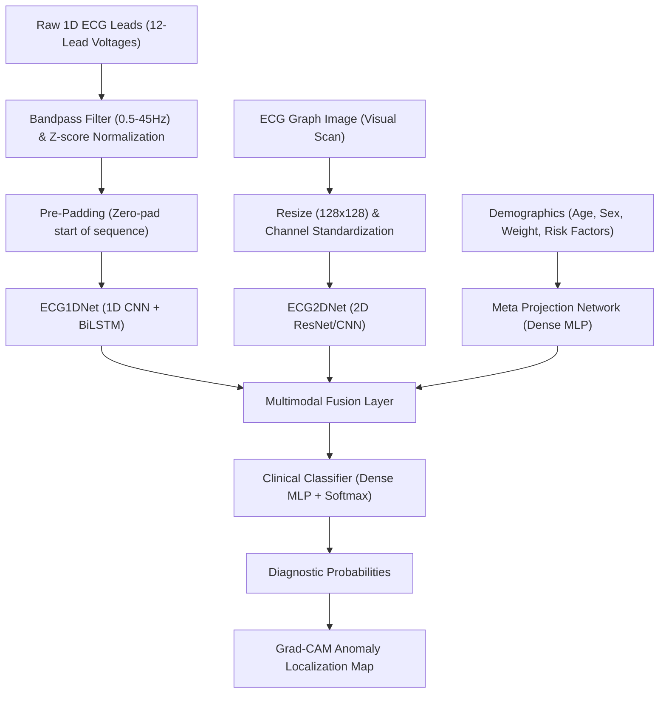

# 🩺 CardioGuard: Multimodal Clinical ECG & Heart Rhythm Analyzer

CardioGuard is a production-grade, clinical-grade open-source deep learning framework designed to detect, classify, and visualize cardiovascular abnormalities from electrocardiogram (ECG) data. 

By integrating raw 1D sequential waveform signals, 2D visual plotted ECG graphs, and clinical patient metadata, CardioGuard employs a **Multimodal Fusion Network** to deliver state-of-the-art diagnostic accuracy accompanied by explainable heatmaps (Grad-CAM/Attention) for clinical decision support.

---

## 🏗️ System Architecture & Data Flow



---

## 📊 Dataset Ingestion Specifications

CardioGuard is engineered to train and cross-validate on three gold-standard clinical ECG databases:

| Dataset | Records / Patients | Data Modalities | Clinical Focus | Role in Project |
| :--- | :--- | :--- | :--- | :--- |
| **PTB-XL Database** | 21,837 records / 18,885 patients | 12-lead raw signals (500Hz) & patient demographics | Multi-label diagnostics (MI, Conduction, Hypertrophy) | Primary dataset for training the Multimodal Fusion Network |
| **MIT-BIH Arrhythmia** | 48 half-hour 2-channel ECGs | Continuous raw signals with beat-by-beat annotations | Premature ventricular contractions, atrial fibrillation | Target dataset for individual heartbeat segmentation & classification |
| **PhysioNet CinC (2020/2021)** | 40,000+ records from global clinics | Heterogeneous multi-lead signals with varying formats | General cardiac abnormalities | Cross-source domain generalizability and noise robustness training |

### 📥 Automating Dataset Downloads
To make setup fast and simple, we provide a Python utility to automatically download and unpack these databases into the correct local directory structure:

```bash
# Run the interactive downloader utility
python models/download_datasets.py
```
This utility prompts you to download specific datasets (or all three concurrently), creating directories and cleaning up temporary archives to preserve disk space.

---

## 🧬 Model Architecture Specs

### 1D Time-Series Network (`ECG1DNet`)
* **Layer 1-2**: 1D Convolutional blocks (`32` and `64` channels) with kernel size `5`, batch normalization, ReLU activation, and `0.3` Spatial Dropout to capture local features.
* **Layer 3**: Bidirectional Long Short-Term Memory (**BiLSTM**) with `64` hidden units per direction, extracting long-range temporal dependencies.
* **RNN Padding Invariant**: Input sequences are **pre-padded** (zero-padding at the beginning). The final hidden state is sliced precisely at index `-1` to prevent zero-padding from diluting the network signal.

### 2D Vision Network (`ECG2DNet`)
* **Core**: Deep 2D CNN (ResNet-like) processing visual ECG plots (e.g. `128x128x3`).
* **Regularization**: 2D Spatial Dropout (`0.3`) and global average pooling to prevent overfitting on plot grid-lines.

### Fusion & Classification Network (`ECGFusionNet`)
* **Feature Aggregation**: Combines 1D temporal features, 2D spatial features, and metadata projection vectors.
* **Classifier**: Multi-layer perceptron (MLP) with Batch Normalization, Dropout (`0.4`), and a final Softmax layer outputting diagnostic category probabilities.

---

## 🔌 API Service Specifications (FastAPI)

The inference gateway exposes REST endpoints configured to handle medical payloads and output structured diagnostics.

### Prediction Payload Schema
`POST /api/v1/predict`

```json
{
  "patient_metadata": {
    "age": 64,
    "sex": "male",
    "weight_kg": 82.5,
    "history_of_mi": true
  },
  "signal_data": [0.012, 0.045, 0.089, -0.012, "... (up to 5000 points)"],
  "lead_count": 12
}
```

### Diagnostic Response Schema
```json
{
  "status": "success",
  "prediction": {
    "primary_diagnosis": "Myocardial Infarction",
    "confidence_score": 0.942,
    "differential_diagnoses": [
      { "label": "Normal Sinus Rhythm", "confidence": 0.048 },
      { "label": "Atrial Fibrillation", "confidence": 0.010 }
    ]
  },
  "explainability": {
    "anomalous_segments": [
      { "start_index": 1200, "end_index": 1450, "intensity_score": 0.89 },
      { "start_index": 3100, "end_index": 3250, "intensity_score": 0.72 }
    ]
  }
}
```

---

## 🛠️ Installation & Setup (Production Guide)

### 1. Prerequisites
Ensure you have Python 3.9+ and CUDA toolkit installed (for GPU-accelerated training).

### 2. Dependency Management
CardioGuard manages dependencies via `pip` (or `poetry` for environment isolation).
```bash
git clone https://github.com/Raghuvaranlokati/cardioguard.git
cd cardioguard
python -m venv venv
source venv/bin/activate  # On Windows: venv\Scripts\activate
pip install -r requirements.txt
```

### 3. Pipeline Ingestion & Training
To generate synthetic verification datasets, train the neural network, and serialize the best weights:
```bash
python models/train.py
```

### 4. Running the API Server Locally
Launch the FastAPI server configured with Uvicorn:
```bash
uvicorn backend.main:app --host 0.0.0.0 --port 8000 --reload
```
Navigate to `http://localhost:8000/docs` to test the API endpoints using the interactive Swagger UI.

---

## 🔒 Security & Medical Compliance Disclaimer
*CardioGuard is designed as an open-source clinical research framework. It is not FDA-cleared or CE-marked for primary diagnostic use. Always verify automated classifications with a certified cardiologist or clinical practitioner.*
